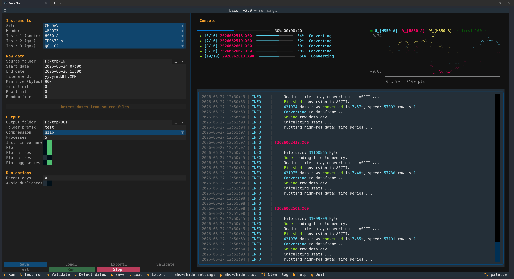

# bico


**Binary Converter for converting ETH eddy covariance binary raw data to ASCII CSV files**

`bico` converts eddy covariance raw data files from a compressed binary format to
uncompressed ASCII (human-readable). Converted files can then be used for flux
calculations in EddyPro.

This is not a general binary format. `bico` reads the binaries written by the
[`sonicread`](docs/sonicread_20190503.pdf) logging script, which records and stores the
raw data for the Grassland Sciences group at ETH Zurich. The data-block specs and
defaults target that setup, so `bico` is built for the group's instruments and sites
rather than as a general-purpose converter.



## How bico works

Eddy covariance loggers store each measurement as a stream of **data blocks**. One
data block holds all the values produced by one instrument at one point in time. A
sonic anemometer block carries the wind components, sonic temperature and a few
status variables; a gas analyzer block carries concentrations (CO2, H2O, and so on),
signal strength and other instrument metrics. The values inside a block are packed as
raw bytes, which is compact but not human-readable.

`bico` reads the byte layout of each block from a **data-block spec** and turns the
binary stream back into labelled numeric columns:

1. **Format specs.** Every instrument and logging variant has a `.dblock` file in
   [`bico/settings/data_blocks`](bico/settings/data_blocks). Each spec lists the
   variables in a block, their byte size, and how the bytes map to a number. Adding
   support for a new instrument means adding a spec file, not changing code. The
   companion `.md` files document each block.
2. **Header.** From the chosen logger header and the selected instruments, `bico`
   builds the full list of output columns (the "Found variables"). Optionally the
   instrument name is prefixed to each variable so columns stay unique across
   instruments.
3. **Decode.** For each raw file `bico` decodes every data block into a table. There
   are two decode paths that always produce byte-for-byte identical output: a
   **vectorized fast path** that decodes the whole file at once with numpy (roughly
   25x faster), and a **sequential fallback** that decodes one field at a time. `bico`
   uses the fast path automatically and falls back when a file's layout is not
   fast-eligible (for example a short or missing data block, or an instrument quirk
   that breaks the fixed byte stride).
4. **Write and summarize.** The decoded table is written as a CSV (optionally
   gzip-compressed). From the same in-memory table `bico` also computes per-file
   statistics and the requested plots, without re-reading the CSV.

Files are converted **one per worker process** in parallel. Each file's log and stats
appear as soon as that file finishes, so progress is visible live rather than dumped
at the end. Worker count comes from the `num_processes` setting (`0` = auto, which uses
all but one CPU core).

Each run writes everything into a single output folder: the converted CSV files, a
`bico.settings` snapshot of the exact settings used, a plain-text run log, a
self-contained HTML log viewer (`<run_id>.log.html`) you can open in a browser, and the
requested plots. The source `bico.settings` is never modified by a run.

See the [**data blocks overview**](bico/settings/data_blocks/README.md) for the full
list of supported instruments (sonic anemometers, IRGA / QCL / LGR gas analyzers), each
linked to its spec and documentation.

## Installation

`bico` requires Python 3.12 and uses [`uv`](https://docs.astral.sh/uv/) for dependency
management. The recommended way to install is from the GitHub repository. `uv` provides
both the dependencies and the Python 3.12 interpreter, so you do not need to install
Python yourself first.

1. **Install `uv`.** Pick the command for your system:
    - Windows (PowerShell): `powershell -ExecutionPolicy ByPass -c "irm https://astral.sh/uv/install.ps1 | iex"`
    - macOS / Linux: `curl -LsSf https://astral.sh/uv/install.sh | sh`

   Then open a new terminal so `uv` is on your `PATH`. Check it with `uv --version`.
2. **Clone the repository** and enter it:
    ```bash
    git clone https://github.com/holukas/bico.git
    cd bico
    ```
3. **Create the environment.** From the repository root, run:
    ```bash
    uv sync
    ```
   This downloads Python 3.12 if it is missing, creates the `.venv` virtual environment,
   and installs every pinned dependency from `pyproject.toml` / `uv.lock`. No separate
   `pip install` or manual `venv` activation is needed.
4. **Run it.** Start the terminal UI with `uv run bico` (see [Usage](#usage)).

To update later, run `git pull` and then `uv sync` again to pick up any changed
dependencies.

**Alternatives:**

- Browse releases at https://github.com/holukas/bico/releases/latest, or download a
  release zip, unpack it, and run `uv sync` inside.
- Install directly from a release tag with pip, which provides the `bico` command:
  `pip install https://github.com/holukas/bico/archive/refs/tags/v2.0.tar.gz`

## Usage

`bico` exposes a `bico` command (run `uv sync` once to set up the environment). The same
command is available as `uv run python -m bico`.

There are two ways to run it: an interactive **terminal UI (TUI)** for configuring and
launching conversions by hand, and a **headless CLI** for automated or scheduled runs.

### Start the TUI (terminal UI)

Start the TUI with either of:

```bash
uv run bico -t
uv run bico        # the TUI is the default when no other action is given
```

The TUI runs full-screen in your terminal and also adapts to smaller window sizes.
Settings are on the left, a live console showing the run log is on the right. It needs
no display server, so it also works over SSH.

**Layout:**

- **Instruments**: site, logger header, and up to three instrument data blocks (sonic
  and gas analyzers).
- **Raw data**: source folder (searched recursively, so files in subfolders are found
  too, not only the folder itself); start/end date (`YYYY-MM-DD HH:MM`, both ends
  inclusive); the filename datetime format (which includes the extension and also
  determines which files are searched, so there is no separate file-extension setting);
  and file-selection settings (`0` = no limit for the file/row limits).
- **Output**: output folder, folder-name prefix, compression, worker processes
  (`0` = auto), and which plots to produce.
- **Run options**: convert only the most recent *N* days (`0` = use the date range), and
  skip files already present in the output folder.

**Workflow:** configure the settings, press **Validate** (`v`), then **Run** (`r`).
**Validate** checks every field, prints the exact settings the run will use (with a short
note on each), and counts the matching files in the source folder. **Run is disabled
until validation passes**, and editing any field disables it again, so you always run
exactly what you validated. **Test run** (`t`) does a quick dry conversion of the first
rows of the first matching file (writing nothing), to confirm the settings produce a
valid result before a full run. **Stop** ends a running conversion early: the file being
converted finishes, no further files are started, and already-converted files are kept.

While a run is in progress, a progress bar shows files done/total with an estimated
remaining time, and below it each in-flight file gets its own line with a per-file
percentage and the current step (Reading, Converting, Saving, and so on), so with several
worker processes you see every file at once. Each file's colour-coded log appears in the
console as soon as that file finishes. A small live plot of the first variables updates
per file during the run (toggle with `p`).

**Key bindings** (also shown in the footer):

- `v`: validate settings (enables Run when everything is OK)
- `d`: detect the time range from the source files (fills Start/End date)
- `t`: test run (dry conversion of the first file, nothing written)
- `r`: run the conversion
- `s`: save the current settings to `bico.settings`
- `l`: load settings from a file (picker)
- `e`: export settings to a chosen folder (seed a headless run folder)
- `p`: show / hide the live plot
- `f`: show / hide the settings panel (console fills the width)
- `Ctrl+L`: clear the console
- `h`: open the in-app help
- `q`: quit

**Settings handling:** the TUI opens with the settings you last saved to
`bico/settings/bico.settings`, so it always starts where you left off. **Save** (`s`)
writes only the user-editable settings back to that file (run-only options such as
"recent days" and "avoid duplicates" are not persisted). **Export…** (`e`) writes the
current form values as a `bico.settings` into a folder you choose, which is how you seed a
headless run folder (see below). **Load…** (`l`) reads a settings file back into the form.

**Drag and drop:** drop a file or folder onto a focused **Source folder** / **Output
folder** field to fill it (a dropped file uses its parent folder). To load a previous
run's settings, use the **Load…** button rather than dropping the file.

**Detect dates** (`d`) scans the source folder, parses every file's date with the filename
datetime format, and fills Start/End date with the earliest and latest file. You can still
adjust the dates afterwards.

**Copy from the console** by dragging with the mouse to select text and pressing
**Ctrl+C** (double-click selects a line).

### Run headless (CLI)

`bico` can run from the command line without the TUI. This is useful for converting files
automatically at scheduled intervals. For example, `bico` is used to convert binary files
to ASCII for the site CH-OE2 once a day:

```bash
uv run bico -f Z:\CH-OE2_Oensingen\20_ec_fluxes\2022\raw_data_ascii -d 8 -a
```

**Options:**

- `-f`, `--folder` — the **run folder**. This must contain a `bico.settings` file and the
  raw binary files for the site. When `-f` is given, `bico` runs headless (no TUI).
- `-d`, `--days` — convert only binary files from the most recent *N* days. Only
  considered when `-f` is given; otherwise the date range in `bico.settings` is used.
- `-a`, `--avoidduplicates` — skip files whose filename already exists in the output
  folder named in `bico.settings`, so files converted on an earlier run are not converted
  again.
- `-t`, `--tui` — start the TUI (ignored if `-f` is given).

Run `uv run bico -h` to see all options.

From another directory, point `uv` at the project: `uv run --project <bico-dir> bico ...`,
or activate the project's virtual environment.

#### Preparing the run folder

For a headless run, the folder you pass with `-f` must contain:

1. **A `bico.settings` file.** This is the only thing `bico` needs to know what to convert.
   `bico` locates it case-insensitively, so a legacy `BICO.settings` is also found. Create
   it one of two ways:
    - In the TUI, configure the settings and use **Export…** (`e`) to write a
      `bico.settings` into this folder, or **Save** (`s`) and copy the resulting
      `bico/settings/bico.settings` into the folder.
    - Edit a copy of an existing `bico.settings` directly in a text editor.

   The key settings inside it are:
    - `site`, `header`, `instrument_1..3` — the site and which instrument data blocks to
      decode.
    - `dir_source` — where the raw binary files are. This can be the run folder itself or
      another path. It is searched recursively, so files in subfolders are found too.
    - `dir_out` — where converted output is written.
    - `start_date` / `end_date` — the time range to convert (used when `-d` is not given).
    - `filename_datetime_format` — the datetime pattern in the raw filenames. It determines
      both how each file's timestamp is parsed and which files are matched, so it must
      match your actual filenames.
    - `file_compression`, `num_processes`, and the `plot_*` flags — output options.
2. **The raw binary files**, located at the `dir_source` path named in `bico.settings`
   (often the same folder).

When the run starts, `bico` reads `bico.settings`, finds the raw files in `dir_source`
that match `filename_datetime_format` and fall in the date range (or the last `-d` days),
converts them, and writes the CSV files, a settings snapshot, a log, an HTML log viewer,
and the requested plots into `dir_out`.

## Documentation

- [Data blocks overview](bico/settings/data_blocks/README.md): all supported instruments
  and logging variants, each linked to its `.dblock` spec and `.md` notes.
- [Settings reference](bico/settings/data_blocks/_help_bico_settings.md): explains every
  variable property used inside a `.dblock` file.
- [Reference comparisons](tests/reference_comparisons.md): regression tests that assert
  byte-identical converted output against a known-good (bico-1.6.0) reference across
  7 cases (24 files) spanning 6 sites.
- [Changelog](CHANGELOG.md): release history and notable changes.

## Testing

Set up the environment with `uv sync`, then run the test suite:

```bash
uv run pytest
```

The default run is fast. The [reference comparisons](tests/reference_comparisons.md) are
marked `slow` and excluded by default (they need large data that lives outside the repo);
run them with `uv run pytest -m slow`.
